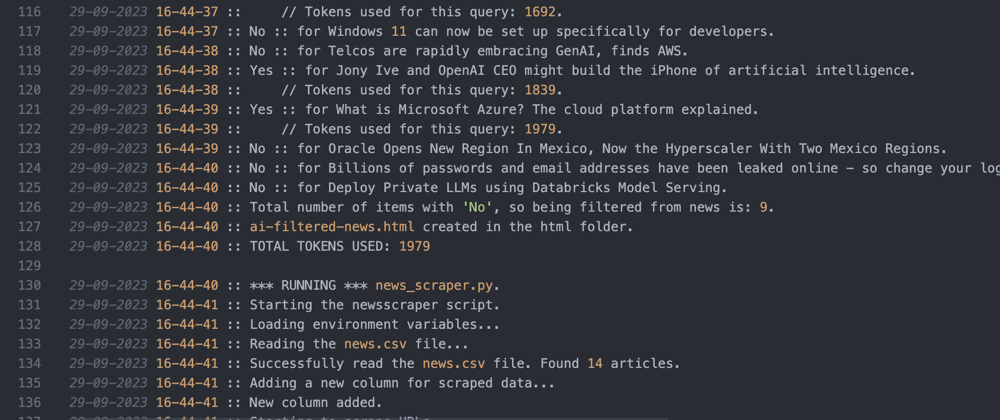

# AI-NewsAggregator

## Fetches news on predefined topics, filters if topic match via AI, scrapes data, makes a summary and sends that (newsletter) by mail <see flow below>.

Screenshot of final output/newsletter:

##  

Flow of the script:

##  

Logfile for detailed logging:

##  

Notes:

* This is a **beta** version 0.0.0.2, just for demo purposes.

Todo/fixes

- [ ]  Token usage written to csv has to be optimized.
- [x] Filter news should also filter on same title. Some news sites publish exactly the same news but different link.
- [x] AI filter should tell in log why it filtered out content.

Improvements & ideas:

- [ ] General:
  - [ ] Launching this script with Open Interpreter as your Copilot script executor
  - [ ] Optimize coding style
- [ ] LLM: make use of local Llama model
- [ ] Better usage of AI tokens/AI engine
- [ ] Add sources like Youtube channels, Twitter(X), Linkedin ...
- [ ] SpeechGPT integration to read your newsletter Google Assistant style "Hey Steven, read me the news" ...

Considerations:

* Prompt engineering, ChatGPT prompt: “You are an artificial journalist, please search online for latest news on artificial intelligence, OpenAI,ChatGPT,Claude,Google Bard,Palm,XAI from Elon Musk at first; then give them in a table with Title,Date Published,Summary in 1 line, Summary in Bullet points and Link to article. Try as many times till you find relevant results.” <Note: doesn’t work always, prompt to be refined.>
* AI-enabled tools for news publishers: <https://www.cnet.com/tech/computing/google-reportedly-pitching-new-ai-tool-to-newsrooms/>

# Here's a detailed overview of what it does, the main.py calls for several script which are listed below

## Importing Modules and Defining Helper Functions

The script starts by importing necessary modules such as `os`, `subprocess`, and `datetime`. It also defines some helper functions for logging and getting the current timestamp.

## Setting Up Logging

The script sets up a logging system that writes to a file in a `logs` directory. The name of the log file includes the current date and time.

## Calling the fetch_news.py Script

For fetching the "bare" news and puts it in \`news.csv'.

## Calling the ai-filtertechnews.py Script

* For filtering the news, see if it does match the SEARCH_TERMS using AI.
* Fetches the amount of tokens used

## Calling news_scraper.py

The script calls the `news_scraper.py` script and logs its output. The `news_scraper.py` script does the following:

* It reads a CSV file named `news.csv` from a `data` directory into a pandas DataFrame.
* It adds a new column to the DataFrame for scraped data.
* It iterates over the DataFrame, and for each row, it attempts to scrape the URL in the `url` column of the DataFrame. It retries up to 3 times if it encounters an error or receives a non-200 status code.
* It saves the DataFrame, which now includes the scraped data, to a new CSV file named `news-scraped.csv` in the `data` directory.
* It also saves the DataFrame as an HTML file named `news-scraped.html` in the `html` directory.

## Calling ai-summarizer.py

The script calls the `ai-summarizer.py` script and logs its output. The `ai-summarizer.py` script does the following:

* It reads the CSV file with the scraped data into a list of dictionaries.
* It iterates over the list, and for each dictionary (representing a row in the CSV file), it attempts to summarize the `scraped_data` field using a `summarize_text` function that uses the `sumy` library.
* It creates a new dictionary for each row, which includes the summarized text and the other fields from the original dictionary.
* Fetches the amount of tokens used.
* It writes the new list of dictionaries to a new CSV file named `aisummary.csv` in the `data` directory.
* It calls another script named `aisummary-to-html.py`.

## Calling sendmail.py

The script calls the `sendmail.py` script twice, once for each of two HTML files (`news.html` and `aisummary.html`), and logs the success or failure of the email sending. The `sendmail.py` script does the following:

* It loads environment variables from a `.env` file, which include the from address, to address, Gmail username, and Gmail password for the email.
* It reads an HTML file and a log file, both specified as command-line arguments.
* It creates an email with the subject 'AI News of Today', the from address and to address loaded from the environment variables, the HTML content as the body of the email, and the log file as an attachment.
* It attempts to send the email using the Gmail SMTP server, with the Gmail username and password loaded from the environment variables.
* It logs whether the email was sent successfully or not.

## Cleaning Up Logs

The script cleans up the `logs` directory, keeping only the 10 most recent log files.

## Logging Completion

The script logs the completion of the script.